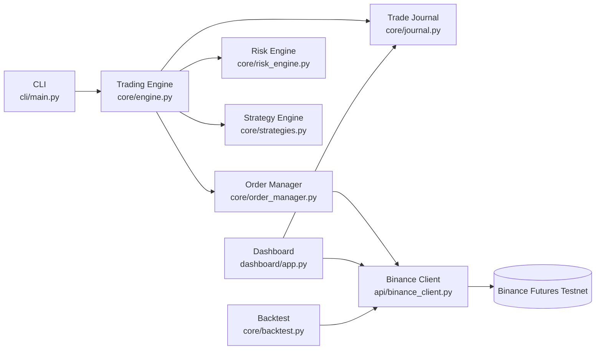
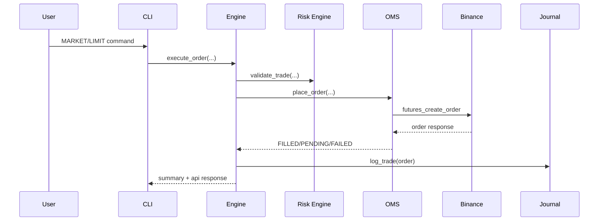
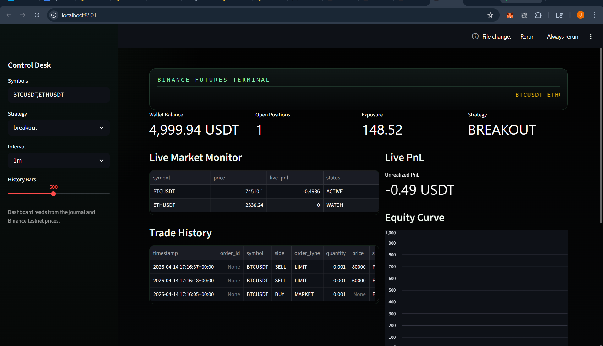
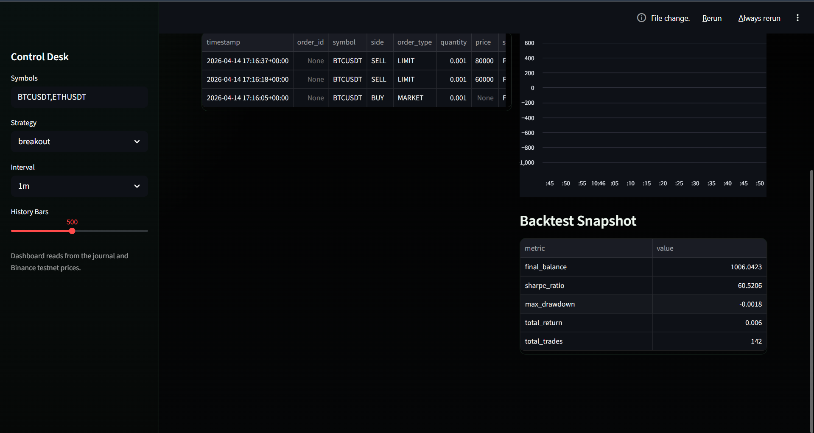
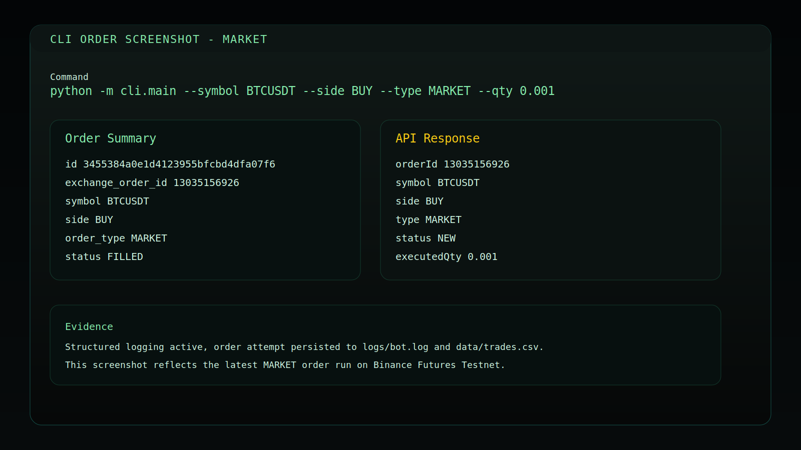
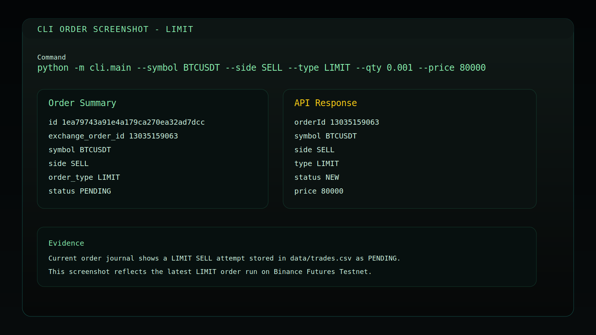
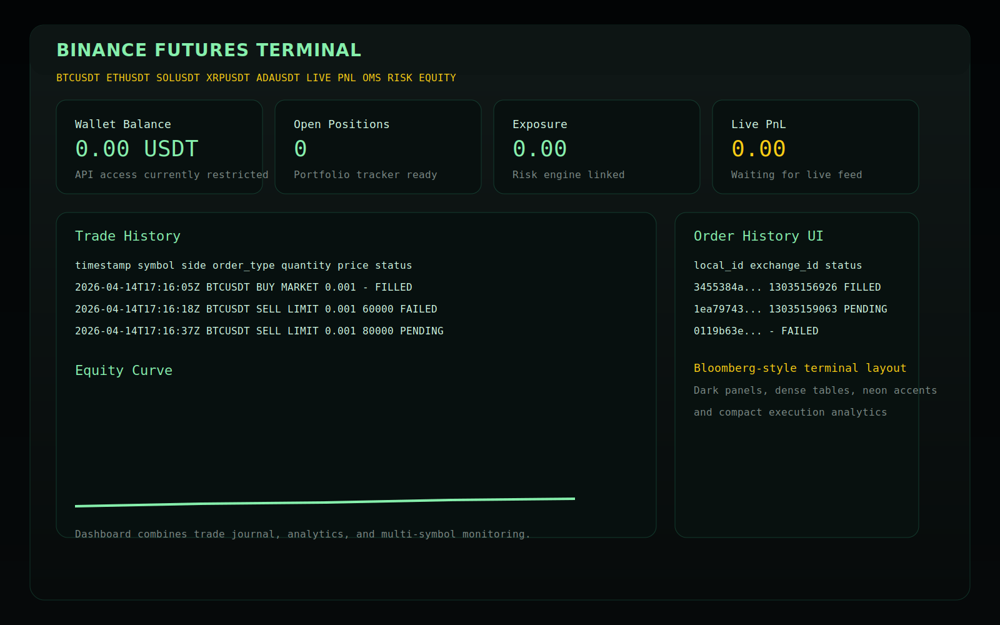

# Advanced Algorithmic Trading Platform

A production-style Python trading platform for Binance Futures Testnet (USDT-M), designed with clean architecture principles and built for both execution and analytics workflows.

## Live App

Open the deployed Streamlit dashboard here: **https://jaytradingbot.streamlit.app/**

## Live Deployment

- Streamlit app: https://jaytradingbot.streamlit.app/
- Deployed mode intentionally runs with API-safe behavior for reliability on hosted environments.
- If Binance API calls fail in deployed mode, the dashboard falls back to journal/log data and surfaces the extracted failure reason from `logs/bot.log`.

## Architecture Overview

### Repository Structure

```text
trading-bot/
├── api/              # Binance REST and WebSocket clients
├── cli/              # Command-line entrypoint and command orchestration
├── core/             # OMS, risk, portfolio, strategy, engine, backtest
├── dashboard/        # Streamlit dashboard
├── utils/            # Logging, retry, and validation helpers
├── data/             # Trade journal CSV
├── logs/             # Runtime logs
├── docs/screenshots/ # Submission screenshots
└── tests/            # Unit test coverage (positive + negative cases)
```

### Component Diagram



### Order Execution Sequence



## Features

### Core Assignment Requirements

- Place MARKET orders
- Place LIMIT orders
- BUY and SELL support
- CLI argument input for symbol, side, type, qty, price
- Order summary and API response output
- Logging and exception handling

### Advanced Platform Features

- Order Management System with in-memory lifecycle tracking
- Portfolio tracking (balance, positions, exposure, live PnL)
- Multi-strategy engine (MA+RSI, breakout)
- Risk controls (risk-per-trade, daily loss gating, position sizing)
- Backtesting with equity curve, Sharpe ratio, drawdown, total trades
- WebSocket price streaming and optional auto-trading
- Streamlit dashboard for execution analytics and journal review
- Automatic fallback mode in dashboard: reads `data/trades.csv` and `logs/bot.log` when API is unavailable, with on-screen reason reporting

## Setup

```bash
python -m venv venv
venv\Scripts\activate
pip install -r requirements.txt
```

Create .env from .env.example:

```env
API_KEY=your_testnet_api_key
API_SECRET=your_testnet_secret
BASE_URL=https://testnet.binancefuture.com
```

## Usage

```bash
# MARKET
python cli/main.py --symbol BTCUSDT --side BUY --type MARKET --qty 0.001

# LIMIT
python cli/main.py --symbol BTCUSDT --side SELL --type LIMIT --qty 0.001 --price 80000

# BACKTEST
python cli/main.py --symbol BTCUSDT --type BACKTEST --strategy ma_rsi --interval 1m --limit 500

# LIVE stream
python cli/main.py --symbol BTCUSDT --type LIVE --strategy breakout --qty 0.001

# Dashboard
streamlit run dashboard/app.py
```

## Screenshots

### Provided Deployed App Screenshots




### Local Submission Artifacts





## Logs and Data Evidence

- Runtime logs: [logs/bot.log](logs/bot.log)
- Trade journal: [data/trades.csv](data/trades.csv)

## Testing

Run tests:

```bash
python -m pytest -q
```

### Current Coverage Includes

- Positive cases:
	- breakout strategy BUY signal
	- risk engine valid position sizing and validation
	- portfolio live PnL for long and short positions
	- order manager tracks FILLED and PENDING states
	- validator accepts normalized valid input
- Negative cases:
	- order manager handles API exception and marks FAILED
	- validator rejects zero quantity
	- validator rejects LIMIT without price
	- risk engine blocks trading after daily loss breach
	- strategy engine rejects unknown strategy

## Design Decisions and Assumptions

- Domain logic is centralized in core modules to keep CLI and dashboard thin.
- Retry and structured logging are first-class reliability concerns.
- Journal writes all attempts for auditability (including failures).
- Deployed dashboard mode favors stability and observability when exchange APIs are restricted by cloud environment/network policy.

## Next Improvements

- Persistent OMS and portfolio snapshots in a database
- Async execution and worker queue for multi-symbol live trading
- Richer dashboard analytics and strategy comparison views
- CI pipeline with linting and coverage gates
